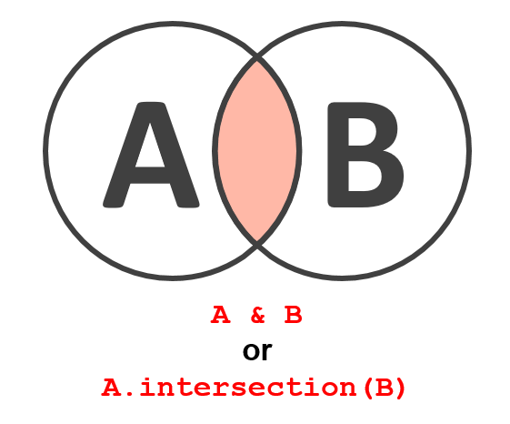

# 🧰 Brian's Carpenter Workshop

I have a lot of useful python tools. Instead of letting them be strewn across the garage, I want to organize them into this "workshop" and make them more useful. I enjoy woodworking and think there are a lot of analogies between carpentry and programing.

**My Python Philosophy**  
- Code should clearly commented. Nay, code should be clearly _narrated_! 
    - Yes, I know this goes against the idea of "don't comment too much," but I feel it's better to error on the side of commenting too much rather than commenting too little.
    - Comments don't necessarily have to say what a line or block does, but it should say _why_ you are doing it that way.
- Stay up-to-date on the most recent stable software. When a new version comes out, use it and read the release notes. New features are added because someone needed those features, and they might be useful in your own work (or, at least useful to know about).
    - Do not assume sticking with a certain version number will prevent breaking changes. [It wont](https://hynek.me/articles/semver-will-not-save-you/). If you want to future-proof your code, it's best to update to newest versions rapidly, find and fix the breaking changes quickly, and enjoy modern software. If you don't update rapidly, you only postpone problems that will pile up and become unbearable. 
- Learn how to use a debugger (like in vscode).
- "If the milk is sour, throw it out!" If the script or block of code you are writing is giving you trouble and just isn't working, toss it and start over. You'll have better luck starting with a clean slate and fresh mind. 
- "If It Ain't Broke, You're Not Trying" – Uncle Red (The Red Green Show). To me, this means that it's ok to have broken code. Don't be too dissapointed in yourself. There is nothing a little duct tape can't repair. It can be fixed, and that is the joy of coding.
- A workman can't have too many tools. Everything has its place. Know how to use your tools. Keep them organized.
    - Use a code formatter; it helps you write cleaner code. (I'm using Black to format my python code.)
- Old band-aids are grows. Don't keep them in your code; fix the issues and then THROW THEM AWAY!

<br><br>

# Install

Installation is easy with pip.

```
pip install git+https://github.com/blaylockbk/Carpenter_Workshop.git
```

Or, clone the repo and install as an "editable" package (so you can pull changes).

```
git clone https://github.com/blaylockbk/Carpenter_Workshop.git
cd Carpenter_Workshop
pip install -e .
```


# Misc.
**Other packages or tools I want to remember that might come in use later**
- [Thermofeel](https://github.com/ecmwf-projects/thermofeel) calculate human thermal comfort indexes
-

<br><br><br>
---

# Quick Reference
I am tired of re-searching for these snippets on the internet. If I put them here, maybe I'll remember they are here.

## Conda
Update from yaml file

```bash
conda env update -f myenv.yml
conda env update -f myenv.yml --prune  # removes dependencies not needed
```

Search for package versions
```bash
conda search packageName
```

Search for package and list dependency info
```bash
conda search packageName=<version> --info
```

Clean unneeded files
```bash
conda clean -tp
```

### Subprocess

```python
def run_command(cmd):
    "Run a command in the shell and return the output"
    return subprocess.run(cmd, shell=True, capture_output=True, check=False, encoding='utf-8')
```


### Matplotlib: Subplot Mosaic

[See documentation](https://matplotlib.org/stable/tutorials/provisional/mosaic.html)

```python
axd = plt.figure(constrained_layout=True).subplot_mosaic(
    """
    ABD
    CCD
    """
)
```

### Matplotlib: Jupyter magic
Enable interactive figure manipulation in Jupyter.
https://github.com/matplotlib/ipympl
(Doesn't always behave the way I think it should.)
```python
%matplotlib widget

import matplotlib.pyplot as plt
```

### Matplotlib: Placing Text with transform coordinates
```python
ax = plt.subplots(2, 3)
txt_fmt = {'horizontalalignment': 'center',
    'verticalalignment': 'center'}
plt.text(.5, .75, 'transFigure', transform=plt.gcf().transFigure,
    color='b', **txt_fmt)
plt.text(.5, .75, 'transAxes', transform=plt.gca().transAxes,
    color='r', **txt_fmt)

```

### Matplotlib: Jupyter Figure Transparency
Use Jupyter Magic to give transparency to the figure displayed in the notebook
```python
%config InlineBackend.print_figure_kwargs = {'facecolor':'none'}
%config InlineBackend.print_figure_kwargs = {'facecolor' : 'w'}
```

### Matplotlib: style parameters
```python
# Use my custom style sheet (if in )
plt.style.use('BB_style')

# Change default date formatter
plt.rcParams['date.autoformatter.day'] = '%b %d\n%H:%M'
plt.rcParams['date.autoformatter.hour'] = '%b %d\n%H:%M'

# Put grid lines behind patches (i.e., bar plots)
plt.rcParams["axes.axisbelow"] = True  

# Needed this to modify fonts in Adobe Illustrator
plt.rcParams['svg.fonttype'] = 'none'
```
### Matplotlib: Stand-alone Colorbar
See my answer on Stack Overflow https://stackoverflow.com/a/62436015/2383070
```python
import matplotlib.pyplot as plt
import matplotlib as mpl
fig = plt.figure()
ax = fig.add_axes([0.05, 0.80, 0.9, 0.1])
cb = mpl.colorbar.ColorbarBase(ax, orientation='horizontal',
 cmap='gist_ncar',
 norm=mpl.colors.Normalize(0, 10), # vmax and vmin
 extend='both',
 label='This is a label',
 ticks=[0, 3, 6, 9])
plt.savefig('just_colorbar', bbox_inches='tight')

```

### Matplotlib: Discrete Colormap and Norm
```python
import matplotlib.pyplot as plt
import matplotlib.colors as mcolors

cmap = plt.get_cmap('bwr', 10)
norm = mcolors.Normalize(vmin=5, vmax=10)
plt.pcolormesh(np.random.rand(10,10)*8+5, cmap=cmap, norm=norm)
plt.colorbar()

# or, make colormap index based on discrete intervals

cmap = plt.get_cmap('bwr', 10)
norm = mcolors.BoundaryNorm([1,2,5,8,10], 10)
plt.pcolormesh(np.random.rand(10,10)*8+2, cmap=cmap, norm=norm)
plt.colorbar(spacing='proportional')
```

### Matplotlib: Dates
```python
import matplotlib.dates as mdates
formatter = mdates.DateFormatter('%Y-%m-%d %H:%M:%S')
ax.xaxis.set_major_formatter(formatter)
```
```python
import matplotlib.dates as mdates
ax.xaxis.set_major_locator(mdates.HourLocator(range(0, 24, 3)))
ax.xaxis.set_minor_locator(mdates.HourLocator(range(0, 24, 1)))
```

Set date autoformatter:
```python
plt.rcParams['date.autoformatter.day'] = '%b %d\n%H:%M'
plt.rcParams['date.autoformatter.hour'] = '%b %d\n%H:%M'
```

Set date ticks
```python
from matplotlib.dates import HourLocator, DateFormatter
plt.plot(pd.date_range('2017-01-01', '2017-01-02', freq='h'), range(25))
plt.gca().xaxis.set_major_locator(HourLocator(byhour=range(0,24,6)))
plt.gca().xaxis.set_major_formatter(DateFormatter('%d %b %Y\n%H:%M\n%A'))
```
### Matplotlib: Colorbars
Custom discreate range
```python
import matplotlib as mpl
import matplotlib.pyplot as plt
data = np.random.rand(5, 5)*100
bounds = [5, 15, 35, 65, 100]
cmap = plt.get_cmap('Spectral_r', len(bounds))
norm = mpl.colors.BoundaryNorm(bounds, cmap.N)
plt.pcolormesh(data, cmap=cmap, norm=norm)
plt.colorbar(spacing='proportional')

```

Adjust colorbar object
```python
import numpy as np
import matplotlib.pyplot as plt
data = np.random.rand(5, 5)*100 
fig = plt.figure()
plt.pcolormesh(data)
plt.colorbar()
print(fig.axes)
fig.axes[1].tick_params(labelsize=30)
```

Colorbar fraction size to match axes
```python
# The magic number is 0.045
# Left plot
plt.colorbar()
# Right plot
plt.colorbar(fraction=0.045)

```

### Matplotlib: Latex Strings
The syntax depends on the character you use. Some require an escape character or use the raw string format.
```python
# Greek Letters
plt.title('$\\theta$') # Use the \\ to escape single \, because \t means tab
plt.title(r'$\theta$') # or, use raw string r''
plt.title('$\\alpha$')
plt.title('$\Delta$')  # Does not require \\ or r''

# Superscript (e.g. wind speed m/s, FSOI J/kg, PM2.5 ug/m3)
plt.ylabel('Wind Speed (m s${^{-1}}$)')
plt.xlabel('FSOI (J kg$^{-1}$)')
plt.ylabel('PM 2.5 Concentration ($\mu$g m${^{-3}}$)')

# Subscript (e.g., CO_2, theta_surface)
plt.ylabel('CO$_2$ (ppm)')
plt.ylabel('$\\theta$${_{surface}}$')  #
plt.ylabel('$\\theta\mathregular{_{surface}}$')  # use \mathregular for non-italics

# Temperature Degree
plt.ylabel('Temperature ($\degree$C)')

```

### Matplotlib: Cartopy `adjustable` axes, 'box' or 'datalim'
```python
fig, axes = plt.subplots(1, 2, subplot_kw=dict(projection=pc, adjustable='datalim'))
for ax in axes:
    ax.coastlines()
```

```python
# Default behavior is "box"
fig, axes = plt.subplots(1, 2, subplot_kw=dict(projection=pc, adjustable='box'))
for ax in axes:
    ax.coastlines()
```


## Pandas Snippets:
### Pandas: DateOffset Strings
Several functions accept a DateOffset frequency string, https://pandas.pydata.org/pandas-docs/stable/user_guide/timeseries.html#dateoffset-objects
``` python
df.resample('5T').mean()
pd.date_range('2015-01-01', '2015-02-01', freq='5D')
```

| String | Meaning | Example
|-------|---------|--------
|'M' |Month end | '3M' - every three months 
|'SM'| Semi month end | 'SM' - every 15th and last day of month. 
|'A' |Year end | '3A' - every 3 years 
|'D' |Day | '2D' -every 2 days 
|'H' |Hour | '6H' -every 6 hours 
|'T' |or 'min' Minute | '5T' - every five minutes 
|'S' |Second | '30S' - every 30 seconds

## Exceptions Warning
```python
try:
    (do something)
except Exception as e:
    print(f"WARNING: {e}")
```

## Debugging: Reload a package
The importlib.reload module allows you to reload a package without closing and restarting a python session.
When I am developing in a notebook that uses imported functions from another module I have written, I sometimes need to make changes to the imported 
module. But simply rerunning the cell that imported the module would not reload the module with the changes I made to that module. I used to think I had 
to rerun the entire script I was working on to included the edits to that module, but you can actually do a hard reload of a package with the importlib.
reload module.
Note that reloading doesn't appear to work for single functions from a package. For example, if you have a function called do_this in a package called my
_pkg , then this will not work:

```python
# DOES NOT WORK!
from my_pkg import do_this
reload(do_this)

# THIS DOES WORK :)
import my_pkg as pkg
reload(pkg)
pkg.do_this()

```

## Set Operations
See more at https://www.learnbyexample.org/python-set/



