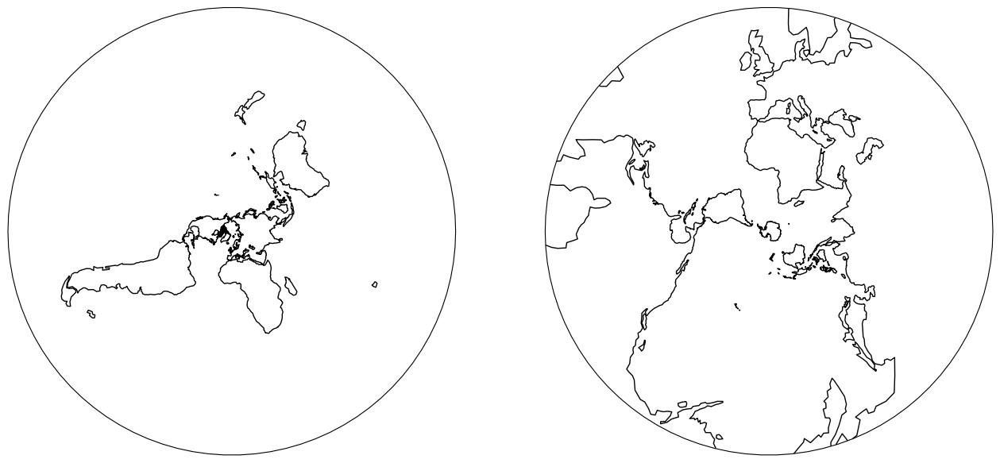
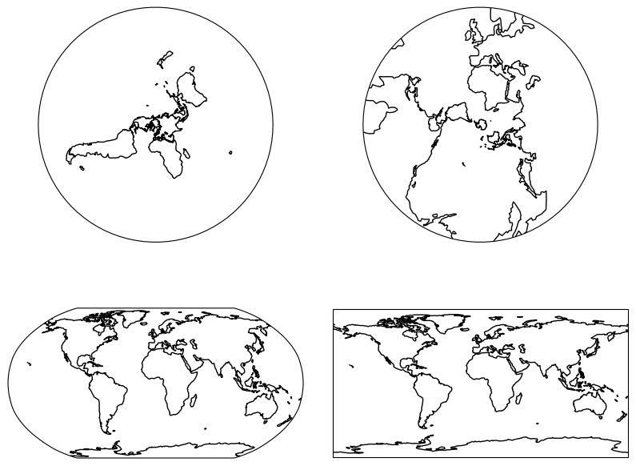

# Cartopy


## `adjustable` axes, 'box' or 'datalim'

```python
fig, axes = plt.subplots(1, 2, subplot_kw=dict(projection=pc, adjustable='datalim'))
for ax in axes:
    ax.coastlines()
```


```python
# Default behavior is "box"
fig, axes = plt.subplots(1, 2, subplot_kw=dict(projection=pc, adjustable='box'))
for ax in axes:
    ax.coastlines()
```


# Different projection for each subplot

```python
import matplotlib.pyplot as plt
import cartopy.crs as ccrs

plt.figure(figsize=[16, 8])
ax1 = plt.subplot(121, projection=ccrs.NorthPolarStereo())
ax2 = plt.subplot(122, projection=ccrs.SouthPolarStereo())

ax1.coastlines()
ax2.coastlines()
```



```python
plt.figure(figsize=[10, 8])
ax1 = plt.subplot(221, projection=ccrs.NorthPolarStereo())
ax2 = plt.subplot(222, projection=ccrs.SouthPolarStereo())
ax3 = plt.subplot(223, projection=ccrs.Robinson())
ax4 = plt.subplot(224, projection=ccrs.PlateCarree())

ax1.coastlines()
ax2.coastlines()
ax3.coastlines()
ax4.coastlines()

plt.subplots_adjust(hspace=0.1, wspace=0.1)
```

