# Matplotlib: Colorbar

## Quick-look Colorbar

In a notebook, you can display a colorbar by itself

```python
plt.get_cmap("viridis")
plt.get_cmap("viridis", 5)
```
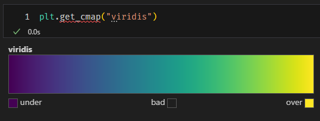

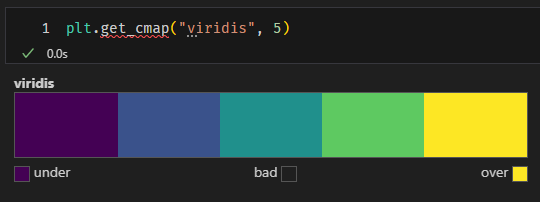

## Stand-alone Colorbar

See my answer on Stack Overflow https://stackoverflow.com/a/62436015/2383070

```python
import matplotlib.pyplot as plt
import matplotlib as mpl

fig = plt.figure()
ax = fig.add_axes([0.05, 0.80, 0.9, 0.1])
cb = mpl.colorbar.ColorbarBase(
    ax,
    orientation='horizontal',
    cmap='gist_ncar',
    norm=mpl.colors.Normalize(0, 10), # vmax and vmin
    extend='both',
    label='This is a label',
    ticks=[0, 3, 6, 9]
)
plt.savefig('just_colorbar', bbox_inches='tight')
```
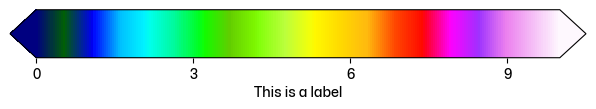

## Discrete Colormap with Norm

```python
import numpy as np
import matplotlib.pyplot as plt
import matplotlib.colors as mcolors

cmap = plt.get_cmap("bwr", 5)
norm = mcolors.Normalize(vmin=5, vmax=10)

data = np.random.rand(10, 10) * 8 + 5
plt.pcolormesh(
    data,
    cmap=cmap,
    norm=norm,
)
plt.colorbar()
```
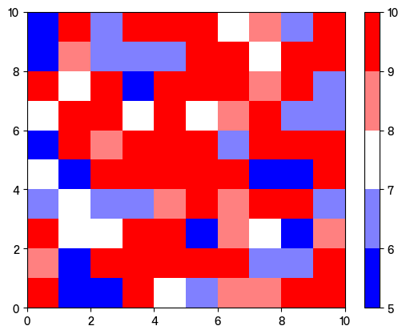

Or, make colormap index based on discrete intervals

```python
import numpy as np
import matplotlib.pyplot as plt
import matplotlib.colors as mcolors

bounds = [5, 6, 8, 10, 12, 20]
cmap = plt.get_cmap("bwr", 5)
norm = mcolors.BoundaryNorm(bounds, cmap.N)

data = np.random.rand(10, 10) * 8 + 5
plt.pcolormesh(
    data,
    cmap=cmap,
    norm=norm,
)
plt.colorbar(spacing="proportional")
```
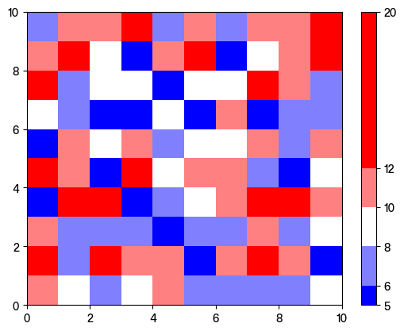

Or, use specific colors

```python
import numpy as np
import matplotlib.pyplot as plt
import matplotlib.colors as mcolors

bounds = [5, 6, 8, 10, 12, 20]
colors = ["#0099ff", "#ffd900", "#9e9e9e", "#171627", "#ac108a"]
cmap = mcolors.LinearSegmentedColormap.from_list("custom_cmap", colors)
norm = mcolors.BoundaryNorm(bounds, cmap.N)

data = np.random.rand(10, 10) * 8 + 5
plt.pcolormesh(
    data,
    cmap=cmap,
    norm=norm,
)
plt.colorbar(spacing="proportional")
```
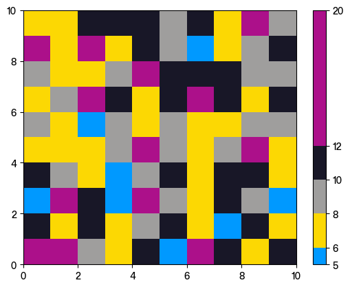

## Text in Colorbar

```python
import numpy as np
import matplotlib.pyplot as plt

ax = plt.axes()
art = ax.pcolormesh(np.random.random([10, 10]), cmap="bwr", vmax=1, vmin=-1)

# Add a shared colorbar for both subplots
cbar = plt.colorbar(art, ax=ax)

cbar.ax.text(
    0.5,
    0.01,
    "Value is Negative",
    transform=cbar.ax.transAxes,
    fontsize=10,
    fontweight="bold",
    ha="center",
    rotation=90,
    va="bottom",
    color="white",
)

cbar.ax.text(
    0.5,
    0.99,
    "Value is Positive",
    transform=cbar.ax.transAxes,
    fontsize=10,
    fontweight="bold",
    ha="center",
    rotation=90,
    va="top",
    color="white",
)
```
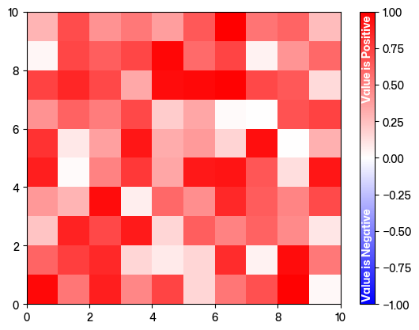

## Adjust colorbar object

```python
import numpy as np
import matplotlib.pyplot as plt

data = np.random.rand(5, 5)*100

fig = plt.figure()
plt.pcolormesh(data)
plt.colorbar()
print(fig.axes)
fig.axes[1].tick_params(labelsize=30)
```
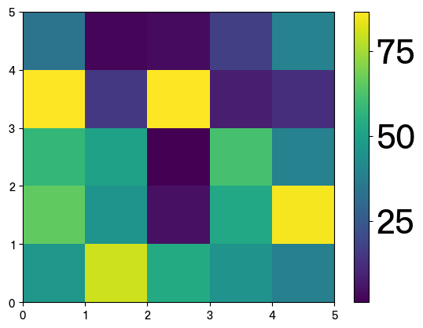

## Shared Axes

```python
import numpy as np
import matplotlib.pyplot as plt

data = np.random.rand(5, 5) * 100

fig, ((ax1, ax2), (ax3, ax4)) = plt.subplots(2, 2)

art = ax1.pcolormesh(data)
ax2.pcolormesh(data)
ax3.pcolormesh(data)
ax4.pcolormesh(data)

plt.colorbar(art, ax=[ax1, ax2, ax3, ax4], location="bottom")
```
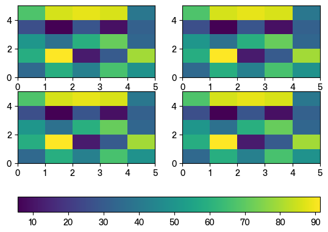

```python
import numpy as np
import matplotlib.pyplot as plt

data = np.random.rand(5, 5) * 100

fig, ((ax1, ax2), (ax3, ax4)) = plt.subplots(2, 2)

art = ax1.pcolormesh(data)
ax2.pcolormesh(data)
ax3.pcolormesh(data)
ax4.pcolormesh(data)

plt.colorbar(art, ax=[ax1, ax2, ax3, ax4], location="right")
```
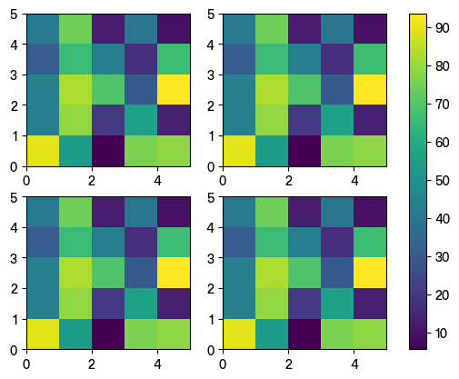

## Adjust colorbar fraction

Colorbar fraction size to match axes

```python
import numpy as np
import matplotlib.pyplot as plt

data = np.random.rand(5, 5) * 100

plt.pcolormesh(data)

# The magic number is 0.045
plt.colorbar(fraction=0.045)
```
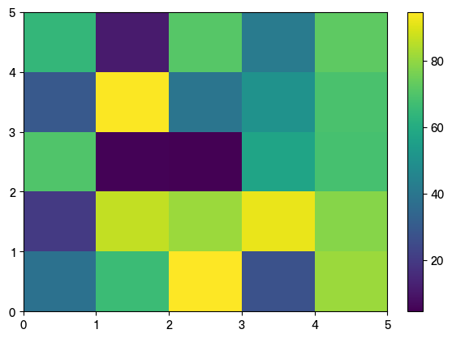

