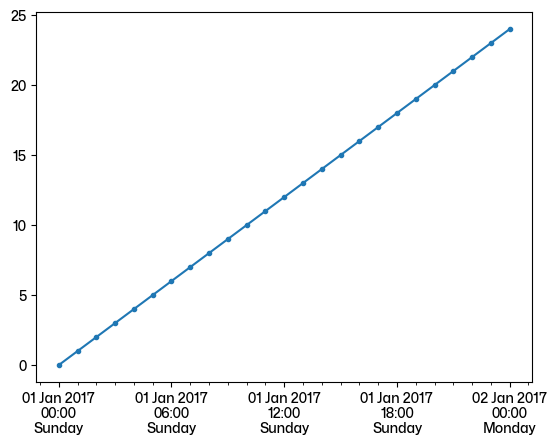

# Matplotlib: Dates

## Date axis ticks label format

```python
import matplotlib.dates as mdates

formatter = mdates.DateFormatter('%Y-%m-%d %H:%M:%S')
ax.xaxis.set_major_formatter(formatter)
```

### Set date autoformatter:

```python
plt.rcParams['date.autoformatter.day'] = '%b %d\n%H:%M'
plt.rcParams['date.autoformatter.hour'] = '%b %d\n%H:%M'
```

## Date axis tick location

```python
import matplotlib.dates as mdates
ax.xaxis.set_major_locator(mdates.HourLocator(range(0, 24, 3)))
ax.xaxis.set_minor_locator(mdates.HourLocator(range(0, 24, 1)))
```

## Tick format and location

```python
import pandas as pd
from matplotlib.dates import HourLocator, DateFormatter

x = pd.date_range("2017-01-01", "2017-01-02", freq="h")
y = range(len(x))
plt.plot(x, y, marker=".")
plt.gca().xaxis.set_major_locator(HourLocator(byhour=range(0, 24, 6)))
plt.gca().xaxis.set_minor_locator(HourLocator(byhour=range(0, 24, 1)))
plt.gca().xaxis.set_major_formatter(DateFormatter("%d %b %Y\n%H:%M\n%A"))
```


## Dates and colorbars

Use Dates on Colorbar Ticks
<https://github.com/matplotlib/matplotlib/issues/17447#issuecomment-630885219>
