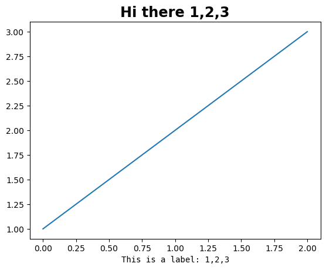

# Matplotlib: Custom Fonts

## Install Font (Linux)

Download and unzip additional fonts in the `~/.fonts` directory.

```bash
mkdir ~/.fonts
```

I like to use Fira Code for monospace font and Mona/Hubos Sans for all other text.

```bash
# Install Fira Code Monospace Font
cd ~/.fonts
mkdir FiraCode
cd FiraCode
wget https://github.com/tonsky/FiraCode/releases/download/6.2/Fira_Code_v6.2.zip
unzip Fira_Code_v6.2.zip

# Install Mona Sans Font
cd ~/.fonts
mkdir MonaSans
cd MonaSans
wget https://github.com/github/mona-sans/releases/download/v1.0.1/MonaSans.zip
unzip MonaSans.zip

# Install Hubot Sans Font
cd ~/.fonts
mkdir HubotSans
cd HubotSans
wget https://github.com/github/hubot-sans/releases/download/v1.0.1/Hubot-Sans.zip
unzip Hubot-Sans.zip
```

Once you have the fonts downloaded, then update the font cache.

```bash
fc-cache
```

> More details at [linuxconfic.org](https://linuxconfig.org/how-to-install-and-manage-fonts-on-linux)

Now delete the Matplotlib Font cache file

```bash
rm ~/.cache/matplotlib/fontlist*
```

# Update rcParams

```python
import matplotlib as mpl

mpl.rcParams["font.sans-serif"] = "Hubot-Sans"  # or "Mona-Sans"
mpl.rcParams["font.monospace"] = "Fira Code"

```

Now when you make figures, the text will use the updated font.

```python
import matplotlib as mpl
import matplotlib.pyplot as plt

# Set custom font
mpl.rcParams["font.sans-serif"] = "Hubot-Sans"
mpl.rcParams["font.monospace"] = "Fira Code"

plt.plot([1,2,3])
plt.title("Hi there 1,2,3", fontsize='xx-large', fontweight='bold')
plt.xlabel("This is a label: 1,2,3", fontfamily='monospace', )
```

| Custom Font | Default Font|
|--|--|
|||


## Additional References

- <https://github.com/pawjast/medium/blob/main/code/17_using_custom_fonts_in_matplotlib.ipynb>
