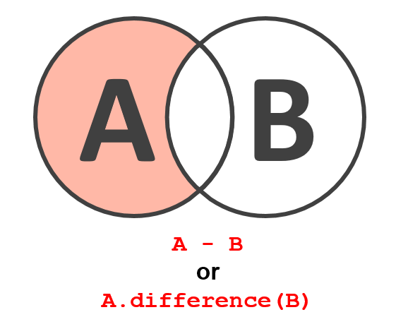
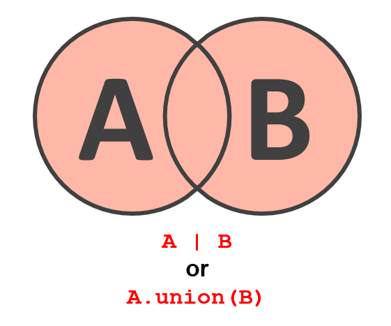
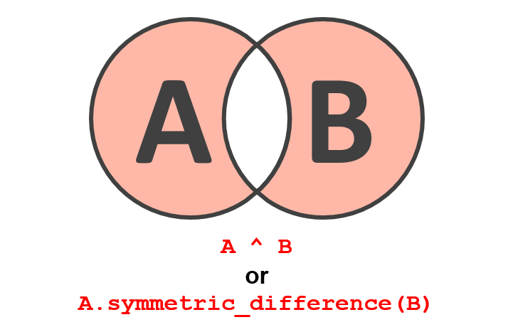
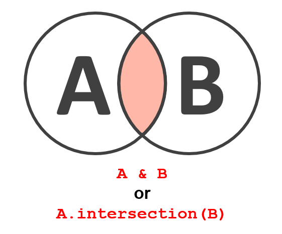

# Set

See more at https://www.learnbyexample.org/python-set/

|                                                                     |                                                             |
| :-----------------------------------------------------------------: | :---------------------------------------------------------: |
|            |         |
|  |  |

